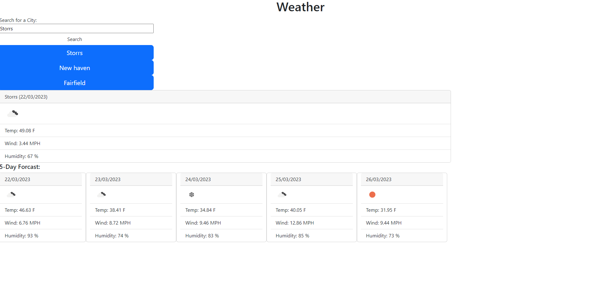

# weather_forcast
UConn coding bootcamp challenge 6
A Weahter app that allows you to search up a city in the US and get a weather report of the day and 5 days after 

## Preview

Formating is bare minimum but functionality is the main aprt

Repo Link: https://github.com/NeelCheo/weather_forcast
Website Link: 